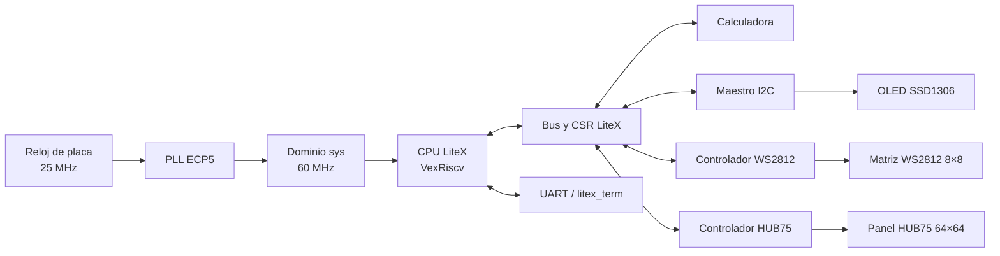

# Digital II — SoC LiteX en Colorlight i9

Este es el proyecto final de Sistemas Digitales II con CamarGOD, está basado en una **Colorlight i9 revisión 7.2**. El sistema integra un procesador con LiteX con cuatro periféricos en RTL:

- calculadora hardware;
- matriz WS2812 de 8 × 8;
- pantalla OLED SSD1306 por I2C;
- panel HUB75 de 64 × 64.

El usuario puede controlar el sistema desde UART mediante un firmware interactivo o cargar una demostración automática que ejecuta una secuencia continua.

## Arquitectura resumida

La tarjeta recibe un reloj físico de 25 MHz. El PLL del ECP5 genera un reloj de sistema de 60 MHz para el procesador, los CSR y los periféricos. El firmware se comunica con los módulos RTL mediante registros CSR generados por LiteX.



La explicación completa está en [documentacion/arquitectura.md](documentacion/arquitectura.md).

## Conexiones principales

| Dispositivo | Señal | Pin Colorlight |
|---|---|---:|
| WS2812 | Datos | J4 |
| OLED SSD1306 | SCL | E5 |
| OLED SSD1306 | SDA | F5 |
| HUB75 | CLK | C17 |
| HUB75 | LAT | D1 |
| HUB75 | OE | C1 |
| HUB75 | A, B, C, D, E | E2, D2, C2, B1, A18 |
| HUB75 | R1, G1, B1 | C3, A3, E3 |
| HUB75 | R2, G2, B2 | D3, C4, B4 |

La OLED se alimenta con **3,3 V**. El panel HUB75 usa alimentación externa de **5 V** y debe compartir tierra con la FPGA. Véase [documentacion/pines.md](documentacion/pines.md).

## Requisitos

- LiteX y LiteX-Boards instalados.
- Ojalá MacOS pero también debe funcionar en linux.
- Toolchain RISC-V.
- Yosys, nextpnr-ecp5 y Trellis.
- `openFPGALoader`.
- Python con Pillow para convertir imágenes.
- Adaptador/programador y conexión UART compatibles con la tarjeta.

## Flujo rápido

Desde la raíz del repositorio:

```bash
make ayuda
make sintetizar
make cargar
make interactiva
```

Para sintetizar, cargar la FPGA y ejecutar la demo interactiva en un solo flujo:

```bash
make todo-interactiva
```

Para la demostración que se reproduce sola después de cargarla por UART:

```bash
make todo-automatica
```

La carga es temporal. Después de apagar o reiniciar la tarjeta se debe cargar nuevamente el bitstream y el firmware.

## Comandos del Makefile

| Comando | Función |
|---|---|
| `make sintetizar` | Construye el SoC y genera el bitstream. |
| `make cargar` | Carga temporalmente el bitstream en SDRAM. |
| `make interactiva` | Compila y envía `demo_integrada` por UART. |
| `make automatica` | Compila y envía `demo_automatica` por UART. |
| `make todo-interactiva` | Sintetiza, carga y ejecuta la demo interactiva. |
| `make todo-automatica` | Sintetiza, carga y ejecuta la demo automática. |
| `make compilar APP=...` | Compila un firmware específico. |
| `make ejecutar APP=...` | Compila y envía un firmware específico. |
| `make puerto` | Muestra el primer `/dev/cu.usbmodem*` detectado. |
| `make estado` | Resume rama, commit, puerto y archivos generados. |
| `make csr` | Muestra los CSR de los periféricos. |
| `make listar-recursos` | Lista imágenes y GIF disponibles. |
| `make limpiar` | Limpia los dos firmwares principales. |
| `make limpiar-todo` | Limpia firmwares y síntesis. |

Se puede fijar manualmente el puerto(Pa’ que lo pruebe en su compu, profe):

```bash
make interactiva PORT=/dev/cu.usbmodem102
```

## Comandos de la demo interactiva

| Entrada UART | Acción |
|---|---|
| `12+5` | Suma. |
| `11-12` | Resta. |
| `7*6` | Multiplicación. |
| `100/4` | División entera.  |
| `R144` o `SQR144` | Raíz cuadrada entera. |
| `T HOLA DAVID` | Muestra texto en OLED y HUB75; anima WS2812. |
| `H` | Muestra ayuda, imagen WS2812 y GIF o imagen  HUB75. |
| `C` | Limpia las tres pantallas. |

## Selección de imágenes y GIF

Imagen para WS2812:

```bash
make recurso-ws2812 \
    IMAGEN_WS2812=recursos/ws2812/kirby.png \
    BRILLO_WS2812=32
```

Imagen o GIF para HUB75:

```bash
make recurso-hub75 \
    RECURSO_HUB75=recursos/hub75/tux.gif \
    FRAMES_HUB75=8 \
    CADA_HUB75=1
```

Generar ambos recursos y ejecutar:

```bash
make interactiva-recursos \
    IMAGEN_WS2812=recursos/ws2812/kirby.png \
    RECURSO_HUB75=recursos/hub75/tux.gif
```

Cambiar una imagen solo obliga a recompilar y volver a cargar el firmware; no requiere sintetizar nuevamente el hardware.

## Organización del repositorio

```text
rtl/cores/                  Núcleos RTL reutilizables
integracion_litex/          SoC y wrappers CSR
firmware/                   Aplicaciones para el procesador
testbench/                  Bancos de prueba RTL
sim/                        Simulación de un SoC LiteX
herramientas/               Conversores de imágenes y GIF
recursos/                   Archivos gráficos de entrada
documentacion/              Explicaciones y diagramas
Makefile                    Flujo principal de trabajo
```

El propósito de cada archivo se explica en [documentacion/mapa_archivos.md](documentacion/mapa_archivos.md).


## Documentación

- [Arquitectura del sistema](documentacion/arquitectura.md)
- [Mapa de archivos](documentacion/mapa_archivos.md)
- [Pines y conexiones](documentacion/pines.md)
- [Firmware](documentacion/firmware.md)
- [Pruebas](documentacion/pruebas/resultados.md)

- [Diagramas](documentacion/diagramas/)
