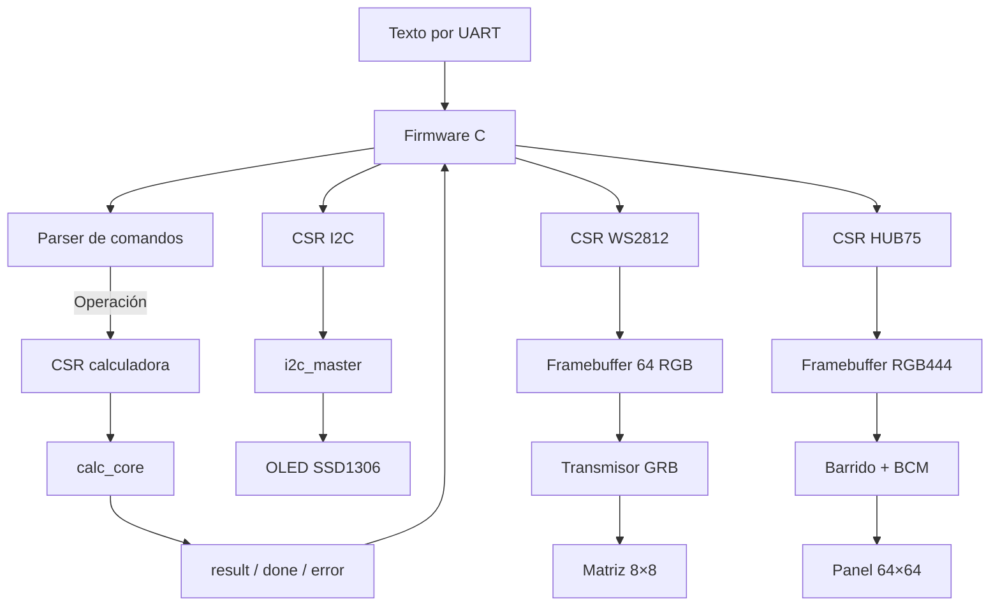

# Arquitectura del sistema

## 1. Objetivo

El proyecto construye un SoC sobre la FPGA ECP5 de una Colorlight i9. LiteX aporta el procesador, el bus, la UART, las memorias y la infraestructura de compilación. Los periféricos del proyecto se implementan en RTL y se conectan al procesador mediante wrappers Migen/LiteX y registros CSR.

La separación principal es:

```text
Firmware C
    ↓ funciones generadas en csr.h
Registros CSR LiteX
    ↓ wrappers Python/Migen
Núcleos Verilog/SystemVerilog
    ↓ señales físicas
OLED, WS2812 y HUB75
```

## 2. Archivo superior del SoC

`integracion_litex/soc/colorlight_i5.py` es el punto de entrada de hardware.

Sus responsabilidades son:

1. importar la plataforma de LiteX-Boards;
2. agregar las extensiones de pines para WS2812, OLED y HUB75;
3. crear el reloj del sistema;
4. construir el `SoCCore`;
5. instanciar los cuatro periféricos;
6. registrar sus bancos CSR;
7. agregar SDRAM, SPI Flash, LED y funciones opcionales;
8. sintetizar o cargar el bitstream según los argumentos de línea de comandos.

### Reloj y reset

La placa entrega `clk25`, de 25 MHz. `_CRG` usa `ECP5PLL` para crear:

- `cd_sys`: reloj principal de 60 MHz;
- `cd_sys_ps`: reloj desfasado para la SDRAM.

El reset físico es `cpu_reset_n`, activo en bajo. El PLL se reinicia cuando el botón está presionado o cuando LiteX activa `self.rst`.

### Recursos del SoC

`SoCCore` integra el procesador y el bus. En las compilaciones realizadas se utiliza VexRiscv. Además se agregan:

- UART para BIOS, terminal y carga del firmware;
- SDRAM externa mediante `GENSDRPHY`;
- caché L2 de 8192 bytes;
- memoria SPI W25Q64 de la i9;
- LED chaser;
- opciones heredadas para Ethernet, SD y video.

La SPI Flash permanece disponible como periférico de LiteX, pero pa’ esta entrega no la logré :c el profe dijo que toca correr litex sin bios y así se puede acceder bien a la no volátil, pero quedará pendiente pa’ un futuro o pa’ embebidos.

## 3. Comunicación por CSR

Los wrappers están en `integracion_litex/perifericos/`.

Un `CSRStorage` es un registro que el procesador escribe. Tiene dos señales importantes:

- `.storage`: conserva el valor escrito;
- `.re`: produce un pulso de un ciclo cuando el procesador escribe el registro.

Un `CSRStatus` lleva información desde el hardware hacia el procesador.

Esta diferencia explica el patrón usado en los periféricos:

```text
Datos y configuración → CSRStorage.storage
Acciones start/write   → CSRStorage.re
Resultados y estado    → CSRStatus.status
```

## 4. Calculadora

### Wrapper

`calculadora.py` expone:

| Dirección lógica | Tipo | Función |
|---|---|---|
| `op1` | Storage, 32 bits | Primer operando. |
| `op2` | Storage, 32 bits | Segundo operando. |
| `opcode` | Storage, 3 bits | Operación seleccionada. |
| `start` | Storage | Su `.re` inicia una operación. |
| `result` | Status, 32 bits | Resultado. |
| `done` | Status | Operación terminada. |
| `busy` | Status | Operación en curso. |
| `error` | Status | División por cero u opcode inválido. |

El wrapper agrega cuatro fuentes SystemVerilog e instancia `calc_core`.

### Núcleo

`calc_core.sv` selecciona entre:

| Opcode | Operación |
|---:|---|
| 0 | suma |
| 1 | resta |
| 2 | multiplicación |
| 3 | división |
| 4 | raíz cuadrada |

Suma y resta se resuelven directamente. Las otras operaciones se delegan a submódulos iterativos.

El estado `LAUNCH_WAIT` separa el pulso de inicio de la lectura de `terminado`. Esto evita aceptar por error el `terminado` que pudiera quedar de una operación anterior.

## 5. WS2812

### Wrapper

`ws2812.py` expone:

- índice de píxel;
- color RGB de 24 bits;
- pulso de escritura;
- pulso de inicio;
- `busy` y `done`.

### Framebuffer y transmisor

`ws2812_matrix_core.v` contiene 64 palabras RGB. El procesador modifica el framebuffer mientras el transmisor está libre. Al recibir `start`, el módulo `ws2812_framebuffer.v` recorre los 64 píxeles y emite 24 bits por LED.

El color se guarda como RGB:

```text
[23:16] R
[15:8]  G
[7:0]   B
```

Antes de transmitir se reordena a GRB, que es el orden esperado por los WS2812.

A 60 MHz los tiempos calculados son aproximadamente:

| Segmento | Ciclos |
|---|---:|
| T0H | 21 |
| T0L | 48 |
| T1H | 42 |
| T1L | 36 |
| Reset | 3600 |

## 6. I2C y OLED

### Wrapper open-drain

`i2c.py` usa `TSTriple` para implementar líneas open-drain reales. El núcleo RTL usa la convención:

```text
oen = 1 → liberar la línea
oen = 0 → forzar cero
```

`TSTriple` usa la convención contraria para `oe`, por lo cual el wrapper conecta:

```text
tristate.oe = ~oen
tristate.o  = 0
```

Las resistencias pull-up hacen que una línea liberada tome nivel alto.

### Transacción implementada

`i2c_master.v` transmite:

```text
START
dirección de 7 bits + W
ACK
data0
ACK
data1
ACK
STOP
```

Para el SSD1306:

- `data0 = 0x00`: `data1` es un comando;
- `data0 = 0x40`: `data1` es un dato de pantalla.

Por esa razón cada comando o byte gráfico de la OLED se envía en una transacción I2C independiente.

## 7. HUB75

### Organización del framebuffer

El panel 64 × 64 se controla como 32 parejas de filas. Cada dirección representa una columna y dos píxeles verticalmente separados por 32 filas:

```text
dirección = fila_de_barrido × 64 + columna
```

Cada palabra tiene 24 bits RGB444:

```text
[23:20] R superior
[19:16] G superior
[15:12] B superior
[11:8]  R inferior
[7:4]   G inferior
[3:0]   B inferior
```

Se usan 2048 palabras: 32 parejas × 64 columnas.

### Lectura y escritura

`ram_dual.v` permite que:

- el procesador escriba por el puerto A con el reloj de 60 MHz;
- el controlador del panel lea por el puerto B.

El firmware activa `blank` antes de escribir un frame completo y lo libera al terminar. Esto evita mostrar una imagen parcialmente actualizada.

### Barrido

`hub75_core.v` deriva un reloj de panel cercano a 6 MHz. La FSM `ctrl_lp4k.v`:

1. desplaza 64 columnas;
2. transfiere los datos con LATCH;
3. habilita la fila durante un tiempo;
4. repite para cuatro planos de bits;
5. cambia de pareja de filas;
6. repite indefinidamente.

`mux_led.v` escoge un bit de cada canal según el plano actual.

`lsr_led.v` genera tiempos 1:2:4:8 para los cuatro planos. Esto permite representar 16 niveles por canal.

## 8. Flujo de datos completo




