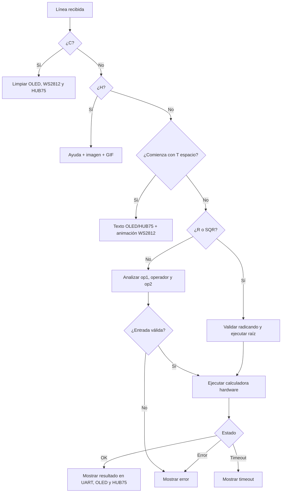

# Firmware

## 1. Papel del firmware

El firmware se ejecuta en el procesador del SoC. No genera directamente las temporizaciones de I2C, WS2812 o HUB75. Su función es:

- recibir y validar comandos;
- escribir operandos y órdenes en los CSR;
- esperar estados del hardware;
- preparar textos, símbolos e imágenes;
- llenar los framebuffers;
- presentar resultados y errores.

Las operaciones estrictamente temporizadas permanecen en RTL.

## 2. Compilación

Cada firmware usa el mismo esquema:

```text
main.c + isr.c

       ↓ compilador RISC-V

main.o + isr.o

       ↓ linker.ld + librerías LiteX

firmware.elf

       ↓ objcopy

firmware.bin
```

El Makefile incluye:

```make
build/colorlight_i5/software/include/generated/variables.mak
$(SOC_DIRECTORY)/software/common.mak
```

Por eso es necesario haber construido el SoC antes de compilar un firmware por primera vez.

## 3. Demo interactiva

Archivo principal:

```text
firmware/demo_integrada/main.c
```

### Inicialización

`main` realiza:

1. limpieza de eventos UART;
2. vaciado de RX;
3. impresión del menú;
4. inicialización del SSD1306;
5. pantalla de inicio;
6. limpieza de WS2812;
7. limpieza de HUB75;
8. lectura continua de caracteres.

### Recepción UART

`uart_getc_filtered` existe porque durante las pruebas el CSR UART podía dejar disponible el mismo carácter inmediatamente después de leerlo.

El procedimiento es:

1. esperar que RX no esté vacío;
2. leer un carácter;
3. limpiar el evento;
4. esperar un tiempo corto;
5. drenar caracteres disponibles de inmediato.

Esto funciona bien al escribir manualmente. Un pegado muy rápido puede ser descartado parcialmente por el drenaje.

### Construcción de la línea

- ENTER termina la entrada y llama `process_line`;
- BACKSPACE elimina el último carácter;
- los caracteres visibles se convierten a mayúscula;
- el búfer tiene 32 bytes;
- una línea demasiado larga se cancela.

### Parser

`process_line` clasifica la entrada en este orden:



## 4. Acceso a la calculadora

`calculator_exec`:

1. escribe `op1`, `op2` y `opcode`;
2. escribe `start`, cuyo `.re` crea un pulso;
3. espera para no observar el `done` anterior;
4. espera `done` con timeout;
5. revisa `error`;
6. lee `result`.

La resta devuelve complemento a dos. `format_result` interpreta el resultado como `int32_t` únicamente cuando el operador es `-`. Así, `11-12` se presenta como `-1` sin afectar el formato de otras operaciones.

## 5. OLED

El firmware implementa directamente la secuencia SSD1306.

Funciones principales:

| Función | Propósito |
|---|---|
| `i2c_send2` | Ejecuta una transacción I2C con control y dato. |
| `oled_command` | Envía control `0x00`. |
| `oled_data` | Envía control `0x40`. |
| `oled_init` | Configura multiplex, charge pump, contraste y orientación. |
| `oled_set_pos` | Selecciona página y columna. |
| `oled_clear` | Escribe cero en 8 páginas × 128 columnas. |
| `font5x7` | Devuelve una columna de un carácter. |
| `oled_draw_char` | Escribe cinco columnas más un espacio. |
| `oled_draw_text` | Escribe una línea. |
| `oled_draw_text_wrap` | Continúa el texto en páginas sucesivas. |

La pantalla se usa en modo de direccionamiento por páginas.

## 6. WS2812

`ws2812_ui.h` incluye:

- espera de disponibilidad;
- escritura de un píxel;
- transmisión de un frame;
- limpieza;
- bitmaps de operadores;
- animación de píxel móvil;
- carga de `imagen_ws2812.h`.

La raíz cuadrada tiene un bitmap separado en `main.c`.

El firmware escribe primero los 64 colores en el framebuffer y después activa `start`. El hardware se encarga de toda la transmisión.

## 7. HUB75

`hub75_ui.h` contiene:

- empaquetado de dos colores RGB444;
- escritura de una palabra;
- limpieza;
- reproducción de frames;
- retrasos de animación;
- fuente y dibujo de texto;
- composición de operación/resultado;
- mensajes y errores.

Para evitar tearing:

```text
blank = 1
escribir 2048 palabras
blank = 0
```

La actualización del panel continúa automáticamente.

## 8. Demo automática

`firmware/demo_automatica/main.c` reutiliza la implementación interactiva:

```c
#define main main_interactivo_no_usado
#include "../demo_integrada/main.c"
#undef main
```

El preprocesador cambia el nombre del `main` original. De esa forma, las funciones `static`, incluido `process_line`, quedan disponibles en la misma unidad de compilación.

La demo ejecuta repetidamente:

```text
T DEMO DIGITAL II
H
12+5
11-12
7*6
100/4
R144
R81
R9
T FPGA LITEX
C
```

Cada comando se procesa por el mismo parser de la demo interactiva. Por ello ambas demos comparten exactamente el comportamiento de pantallas, cálculos y errores.

Esta reutilización es práctica para la entrega, aunque una evolución futura más modular sería mover las funciones compartidas a `demo_comun.c/.h`.

## 9. Firmwares de diagnóstico

Los firmwares pequeños permiten probar subsistemas sin ejecutar todo el proyecto:

```text
uart_test       → recepción UART
calculadora     → CSR y operaciones
ws2812          → matriz 8×8
i2c_oled        → OLED y etapa previa de integración
hub75_diag      → pines, filas y colores
hub75_demo      → imágenes y GIF
```


