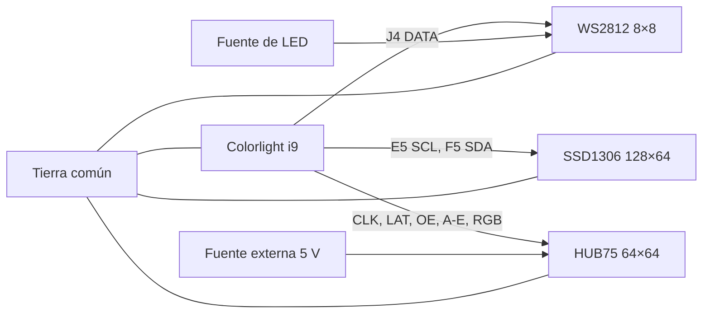

# Pines y conexiones

## 1. Tarjeta

- Placa: Colorlight i9.
- Revisión usada: 7.2.
- FPGA: familia Lattice ECP5.
- Reloj físico: `clk25`, 25 MHz.
- Reloj del SoC: 60 MHz.
- Reset físico: `cpu_reset_n`, activo en bajo.
- LED de usuario: `user_led_n`, activo en bajo.

Los pines de reloj, reset, UART, SDRAM y programador provienen de la definición oficial de la plataforma `colorlight_i5` de LiteX-Boards. Los pines siguientes son extensiones declaradas directamente en `colorlight_i5.py`.

## 2. Matriz WS2812 8 × 8

| Señal | Pin |
|---|---:|
| DATA | J4 |

Conexión:

```text
Colorlight J4 ───────── DIN de la matriz
GND Colorlight ──────── GND de la matriz/fuente
5V Colorlight ───────── VCC de la matriz
```


## 3. OLED SSD1306 por I2C

| Señal OLED | Pin Colorlight |
|---|---:|
| SCL/SCK | E5 |
| SDA | F5 |
| VCC | 3,3 V |
| GND | GND |

Dirección usada:

```text
0x3C
```

Las líneas se configuran como LVCMOS33 con pull-up interno. En un montaje definitivo son preferibles resistencias pull-up externas apropiadas si el módulo no las incorpora.

## 4. Panel HUB75 64 × 64, scan 1/32

### Control

| Señal | Pin |
|---|---:|
| CLK | C17 |
| LAT | D1 |
| OE | C1 |

### Selección de fila

| Señal | Pin |
|---|---:|
| A | E2 |
| B | D2 |
| C | C2 |
| D | B1 |
| E | A18 |

### Datos de color

| Señal | Pin |
|---|---:|
| R1 | C3 |
| G1 | A3 |
| B1 | E3 |
| R2 | D3 |
| G2 | C4 |
| B2 | B4 |

El orden de pines RGB se ajustó durante las pruebas para corregir el intercambio entre rojo y azul.

### Alimentación

```text
Fuente externa 5 V ─── panel HUB75
GND de fuente ───────── panel HUB75
GND de fuente ───────── GND Colorlight
```

No se recomienda alimentar el panel desde la tarjeta. El panel puede exigir varios amperios dependiendo de la imagen y el brillo.

## 5. Diagrama físico resumido




